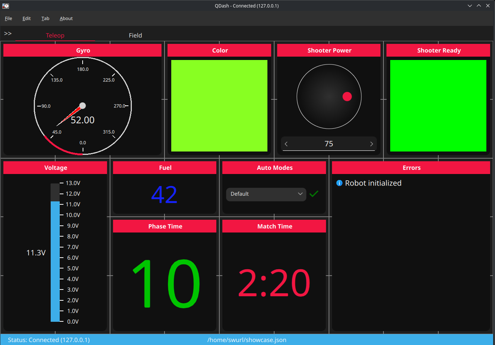

A reliable, high-performance, low-footprint dashboard for use with FRC.

A mirror of this repository is available on my [git](https://git.swurl.xyz/QFRC/Dashboard.git) instance.


## Lightweight
Dashboards don't have to be resource hogs. In fact, dashboards should be designed to take up as few resources as possible. Dashboards that use up resources like nobody's business will cause **packet loss** and **comms issues** when run on driver stations!

Because of this, QDash has been specifically designed to use up as few resources as possible. Compared to WPILib's Shuffleboard (measured on a ThinkPad X220--percentages include all CPU cores):

| Metric            | Shuffleboard  | QDash |
| ----------------- | ------------- | ------------- |
| Memory (Base)     | 530MB         | 100MB         |
| Memory (Heavy Use)| 600MB-1.2GB   | 150MB         |
| CPU (Base)        | 2-10%         | 0%            |
| CPU (Heavy Use)   | 10-30%        | 0-1%          |

QDash excels with its lightweight performance thanks to many factors:
- Qt & QML's high efficiency
- No menu that subscribes to every topic at once
- Shared subscriptions between duplicate topics
- Widgets only update and repaint when they need to

## Usage
For tutorials on getting started, robot code interaction, theming, and more, see the [wiki](https://github.com/Q-FRC/QDash/wiki).

## Download
Windows, Linux, and macOS builds are available via GitHub Actions. Currently, all use WPILib 2025.3.1. Release builds are available either through Actions or in the releases tab:

[](https://github.com/Q-FRC/QDash/actions/workflows/trigger_release.yml)

## Forking
Follow the [GPL3](LICENSE) of this project, credit the original project, and make it clear that your application is not QDash itself.

## Building
This project uses CMake.

```bash
git submodule update --init
cmake -S . -B build
cd build
make -j$(nproc)
```

You can use CMake's install commands to install for packaging and system installs.

```bash
sudo cmake --install build --prefix /usr
cmake --install build --prefix ${PKGDIR}
```

### Linux
>[!WARNING]
> QDash requires Qt 6.7 or later.
> **Debian and Ubuntu LTS releases are currently stuck at earlier versions.**
> Instead, it's recommended to use aqtinstall or the Qt online installer.

```bash
# or whatever your distribution uses
sudo pacman -S qt6-base qt6-multimedia base-devel ninja

git clone https://github.com/Q-FRC/QDash.git
cd QDash
cmake -S . -B build -G Ninja
cmake --build build
```

### Windows
- Install Qt from [here](https://www.qt.io/download-qt-installer-oss). Take note of where you download it!
  * Note that you will need to create a Qt account; alternatively, you may use aqtinstall.
  * By default, you will only need MSVC2022 and Qt Multimedia.
- Install CMake https://cmake.org/download/ (add to `PATH`)

```bash
git clone https://github.com/Q-FRC/QDash.git
cd QDash
cmake -DCMAKE_PREFIX_PATH="C:\\Qt6\\6.9.1\\msvc2022_64" -S . -B build
cmake --build build
```

Alternatively,  use [CLion](https://www.jetbrains.com/clion/) or Qt Creator from the online installer.
