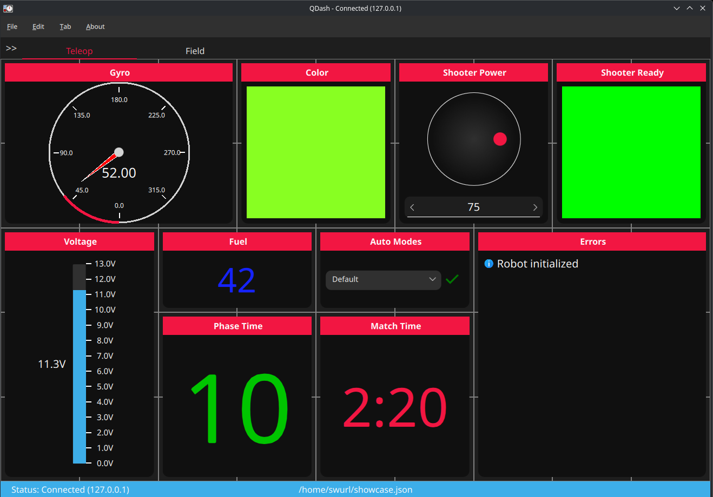

# QDash

A reliable, high-performance, low-footprint dashboard for use with FRC.



## Lightweight

Dashboards don't have to be resource hogs. In fact, dashboards should be designed to take up as few resources as possible. Dashboards that use up resources like nobody's business will cause **packet loss** and **comms issues** when run on driver stations! To counteract this, QDash has been specifically designed from the ground up to use as few resources as possible, *without* sacrificing aesthetics or usability.

### Benchmarks

The following numbers were measured on a ThinkPad X220T (i5-2520M). The numbers were measured on Linux/X11 on KDE Plasma 6, and cross-verified on the same laptop running Windows 10 22H2 and Windows 11 25H2. These tests used the default options for all dashboards, and used the *Graphide* theme for QDash (the heaviest in terms of CPU and memory).

| Metric            | Shuffleboard  | QDash         | Elastic |
| ----------------- | ------------- | ------------- | ------- |
| Memory (Base)     | 550MB         | 70MB          | 140MB   |
| Memory (Heavy Use)| 620MB-1.5GB   | 228MB         | 472MB   |
| CPU (Base)        | 2-20%         | 0%            | 0%      |
| CPU (Heavy Use)   | 30-85%        | 5%            | 35%     |

QDash excels with its lightweight performance thanks to:

- Qt Quick's efficiency & full GPU acceleration
- [Carboxyl](https://git.crueter.xyz/crueter/Carboxyl)'s performance shims, low-footprint theming system, and compatibility layers
- No menu that subscribes to every topic at once
- Shared subscriptions between duplicate topics
- Widgets only update and repaint when they need to

## Themes

QDash uses [Carboxyl](https://git.crueter.xyz/crueter/Carboxyl) for its themes. Carboxyl is a theming engine and style library, designed with 5 major styles (with more to come) suiting different preferences. Carboxyl's themes were designed with several years of extensive UI design research, large-scale user studies, and feedback from UI critics. Multiple professional groups and individuals have assisted throughout Carboxyl's development process, and QDash in its current state would not be possible without the unwavering support and keen eyes of these people.

See Carboxyl's README for a quick overview of each theme. Otherwise, try it out for yourself!

## Usage

For tutorials on getting started, robot code interaction, theming, and more, see the [wiki](https://git.crueter.xyz/QFRC/QDash/wiki/Home).

## Download
Windows, Linux, and macOS builds are available via GitHub Actions. Currently, all use WPILib 2025.3.1. Release builds are available on an [external GitHub repository](https://github.com/QDash-CI/Releases).

[](https://github.com/QDash-CI/Workflow/actions/workflows/tag.yml)

## Forking

Follow the [GPLv3](./LICENSE) of this project, credit the original project, and make it clear that your application is not QDash itself.

## Building

This project uses CMake.

```bash
git submodule update --init
cmake -S . -B build
cd build
make -j$(nproc)
```

You can use CMake's install commands to install for packaging and system installs.

```bash
sudo cmake --install build --prefix /usr
cmake --install build --prefix ${PKGDIR}
```

### Linux

```bash
# or whatever your distribution uses
sudo pacman -S qt6-base qt6-multimedia qt6-declarative base-devel ninja

git clone https://git.crueter.xyz/QFRC/QDash.git
cd QDash
cmake -S . -B build -G Ninja
cmake --build build
```

### Windows
- Install Qt from [here](https://www.qt.io/download-qt-installer-oss). Take note of where you download it!
  * Note that you will need to create a Qt account; alternatively, you may use aqtinstall.
  * By default, you will only need MSVC2022 and Qt Multimedia.
- *Alternatively, you may pass `-DQDASH_BUNDLE_QT=ON` to the CMake command*
- Install CMake https://cmake.org/download/ (add to `PATH`)

```bash
git clone https://git.crueter.xyz/QFRC/QDash.git
cd QDash
cmake -DCMAKE_PREFIX_PATH="C:\\Qt6\\6.9.1\\msvc2022_64" -S . -B build
cmake --build build
```

Alternatively,  use [CLion](https://www.jetbrains.com/clion/) or Qt Creator from the online installer.
